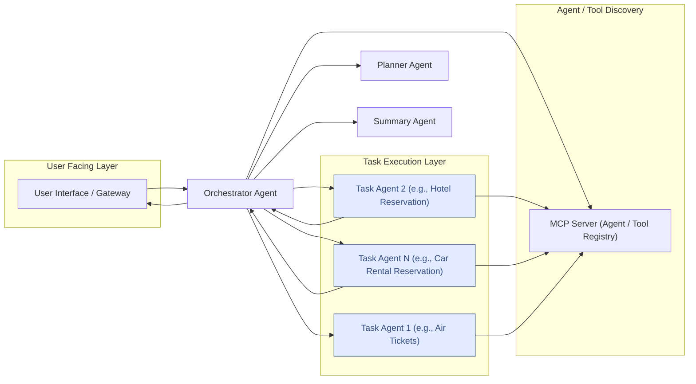

# A2A with MCP as Registry（MCPをレジストリとして使用するA2A）

**Model Context Protocol (MCP) を標準化されたメカニズムとして活用し、Google A2A Agent Cards を発見・取得することで、A2Aを使用した動的なエージェント間相互作用を実現します。**

## 目次

- [A2A with MCP as Registry](#a2a-with-mcp-as-registry)
  - [目次](#目次)
  - [目的](#目的)
  - [背景](#背景)
    - [A2Aプロトコル](#a2aプロトコル)
    - [Model Context Protocol (MCP)](#model-context-protocol-mcp)
  - [コア提案](#コア提案)
    - [Agent Cardsの保存](#agent-cardsの保存)
    - [MCP経由でのエージェント発見](#mcp経由でのエージェント発見)
    - [Agent Cardsの取得](#agent-cardsの取得)
    - [タスクに適したエージェントの検索](#タスクに適したエージェントの検索)
    - [A2A通信の開始](#a2a通信の開始)
  - [ユースケース: オーケストレーションによるタスク実行](#ユースケース-オーケストレーションによるタスク実行)
    - [コアコンセプト](#コアコンセプト)
    - [アーキテクチャコンポーネント](#アーキテクチャコンポーネント)
  - [例: 旅行エージェント](#例-旅行エージェント)
  - [実行手順](#実行手順)
    - [ファイル/ディレクトリの説明](#ファイルディレクトリの説明)
  - [免責事項](#免責事項)

## 目的

Model Context Protocol (MCP) を標準化されたメカニズムとして活用し、Google A2A Agent Cards を発見・取得することです。これにより、特にA2Aプロトコルを利用する計画・オーケストレーションエージェント向けの動的なエージェント間相互作用が可能になります。

## 背景

### A2Aプロトコル

Agent-to-Agent (A2A) プロトコルは、エージェント間のランタイム通信を標準化します。以下を定義します：

- **Agent Card:** エージェントの識別情報、機能（アクション/関数）、相互作用エンドポイントを記述するJSONスキーマ。
- **メッセージ形式と相互作用フロー:** 直接的なエージェント間相互作用のための`ExecuteTask`など。

詳細については、[A2A SDK解説ドキュメント](A2A_SDK_GUIDE.md)を参照してください。

### Model Context Protocol (MCP)

MCPは、アプリケーション（AIモデルを含む）が「ツール」「リソース」などのコンテキスト情報を発見、アクセス、利用するための標準的な方法を定義します。

詳細については、[用語解説集](GLOSSARY.md)を参照してください。

## コア提案

中心的なアイデアは、MCPサーバーをA2A Agent Cardsの集中化された、クエリ可能なリポジトリとして使用することです。

### Agent Cardsの保存

- 各A2A Agent Card（JSON）が保存されます（例：JSONファイルとして）。
- MCPサーバーはこれらのAgent Cardsをリソースとして公開します。
- 基盤となるストレージシステムは、ファイルシステム、データベース、またはベクトルストアでも可能です。この例では、ファイルシステムに保存されたエージェントカードを使用し、埋め込みを生成してマッチングを見つけます。

### MCP経由でのエージェント発見

- クライアントはMCPサーバーのリソースAPI（`list_resources`）をクエリして、利用可能なエージェントカードを発見します。
- 追加のメタデータ（例：`streaming`サポート、`currency conversion`などのタグ）を使用してフィルタリングを適用できますが、この例では明示的にはカバーされていません。

### Agent Cardsの取得

- リクエストするエージェントは、リソースURI（発見から取得）を使用して、MCPサーバーAPI経由で完全なJSON Agent Card(s)を取得します。

### タスクに適したエージェントの検索

- リクエストするエージェントは、MCPサーバーで公開されているツールを使用して、特定のクエリに最も関連性の高いエージェントを見つけることができます。

### A2A通信の開始

- Agent Card(s)が取得されると、リクエストするエージェントはそれらをA2AClientで使用します。
- コラボレーターを必要とするエージェント（計画エージェントなど）は、標準のA2Aプロトコルを使用してターゲットエージェントと直接通信します。
- 発見後、この直接的なランタイム相互作用にはMCPは関与しません。

## ユースケース: オーケストレーションによるタスク実行

このシステムは、専門化されたエージェントが動的に協力するワークフローを可能にします。

### コアコンセプト

1. **オーケストレーション:** PlannerとExecutorエージェントがユーザークエリの全体的なフローを管理します。
2. **専門化:** タスクエージェントは特定の種類のタスクの専門家です。
3. **動的発見:** MCPサーバーにより、Executorを変更することなく、タスクエージェントの柔軟な追加、削除、更新が可能になります。
4. **標準化された通信:** A2Aプロトコルにより、信頼性の高いエージェント間通信が保証されます。

### アーキテクチャコンポーネント

1. **ユーザーインターフェース (UI) / アプリケーションゲートウェイ:** ユーザークエリのエントリーポイント。
2. **Orchestrator Agent（オーケストレーターエージェント）:**
   - Planner Agentから構造化されたプランを受信します。
   - タスクを反復処理します。
   - 各タスクについて：
     - タスク（および追加の機能）に基づいて、MCPサーバーに適切なタスクエージェントをクエリします。
     - A2A経由でタスクエージェントに接続し、タスクの詳細を送信します。
     - A2A経由でタスクエージェントから結果を受信します。
     - タスクの状態とエラーを管理します。
   - 結果を検証し、必要に応じて再計画をトリガーします。
   - 結果を統合、要約し、一貫性のあるユーザー応答にフォーマットします。
3. **Planner Agent（プランナーエージェント）:**
   - 生のユーザークエリを受信します。
   - クエリを構造化されたタスクプラン（潜在的にDAG）に分解し、各タスクに必要な機能を指定します。
4. **Model Context Protocol (MCP) Server（MCPサーバー）:**
   - タスクエージェントのレジストリとして機能し、そのAgent Cardsをホストします。
   - Executor Agentがエージェントをクエリするためのインターフェースを提供します。
   - Executor Agentがツールをクエリするためのインターフェースを提供します。
5. **Task Agents（タスクエージェントプール/フリート）:**
   - 独立した、専門化されたエージェント（例：検索エージェント、計算エージェント）。
   - A2A互換エンドポイントを公開します。
   - タスクを実行し、A2A経由でExecutorに結果を返します。
6. **A2A通信レイヤー:** エージェント間通信の基盤となるプロトコル。



## 例: 旅行エージェント

1. ユーザーが旅行プランをリクエストします。
2. **Orchestrator Agent**がリクエストを受信します。
   1. MCP経由で**Planner Agent**のカードを検索し、接続します。
   2. Planner Agentを呼び出して詳細なプランを取得します。
   3. プランの各ステップについて：
      1. MCPツール（例：`find_agent`）を呼び出して、最適なタスクエージェントのAgent Cardを取得します。
      2. 選択したタスクエージェントをA2A経由で呼び出してタスクを実行します：
         - _航空券:_ タスクエージェントはMCPサーバーからヘルパーツールを使用します。ツールはSQLLiteデータベースをクエリしてフライトを見つけます。
         - _ホテル:_ タスクエージェントはMCPサーバーからヘルパーツールを使用します。
           ツールはSQLLiteデータベースをクエリしてホテルを見つけます。
         - _レンタカー:_ タスクエージェントはMCPサーバーからヘルパーツールを使用します。
           ツールはSQLLiteデータベースをクエリしてレンタカーを見つけます。
      3. 結果をメモリに保存します
   4. 結果を集約し、クライアント用に要約します。
   5. エージェントが予算の不一致や予約の失敗を発見した場合、再計画タスクが開始されます。

## 実行手順

このサンプルは、タスクを実行する3つのADKエージェントと、プランナーとして機能するLangGraphエージェントを使用して構築されています。
3つのADKエージェントはすべて同じPythonコードを使用しますが、異なるエージェントカードでインスタンス化されます。

以下のコマンドを実行して、1つのターミナルですべてのステップを実行できます：

```sh
bash samples/python/agents/a2a_mcp/run.sh
```

詳細な手順については、[動作マニュアル](OPERATION_MANUAL.md)を参照してください。

### ファイル/ディレクトリの説明

- **`agent_cards/`**: 各A2A Agent CardのJSONスキーマを保存するディレクトリ。これらのカードは、システム内の異なるエージェントの識別情報、機能、エンドポイントを定義します。MCPサーバーがこれらのカードを提供します。

  - `*_agent.json`: 各JSONファイルは、特定のエージェントのカードを表します（例：フライト予約を処理するエージェントの`air_ticketing_agent.json`）。

- **`src/a2a_mcp/`**: このA2A with MCPサンプルの主要なPythonソースコード。

  - **`agents/`**: 設計ドキュメントで説明されている異なるタイプのエージェントのPython実装を含みます。
    - `__main__.py`: エージェントサービスを起動するメインスクリプト。
    - `adk_travel_agent.py`: ADKを使用して構築されたコア旅行エージェントで、異なるエージェントカードを使用してエージェントをインスタンス化します。
    - `langgraph_planner_agent.py`: LangGraphを使用した「Planner Agent」の実装で、ユーザーリクエストを構造化されたプランに分解する責任があります。
    - `orchestrator_agent.py`: 「Orchestrator Agent」の実装で、Plannerからプランを受け取り、MCP経由で適切なタスクエージェントを発見し、A2Aを使用してそれらを呼び出します。
    - `itinerary_agent.py`: 予約結果から包括的なマークダウン形式の旅程表を生成する独立したエージェント。
  - **`common/`**: 複数のエージェントまたはシステムの一部で使用される共有コードを保持します。
    - `agent_executor.py`: オーケストレーションフロー内のタスクの状態、依存関係、実行を管理するA2Aモジュール。
    - `agent_runner.py`: ADKエージェントインスタンスを実行し、そのライフサイクルを管理し、そのサービスを公開するユーティリティまたはフレームワークコンポーネント。
    - `base_agent.py`: このプロジェクト内のすべてのエージェントの共通メソッドとプロパティを定義する抽象基底クラスまたはインターフェース。
    - `prompts.py`: エージェント内でLarge Language Models (LLMs) と相互作用するために使用される事前定義されたプロンプトテンプレートを含みます（例：計画や要約のため）。
    - `types.py`: プロジェクト全体で使用されるカスタムPythonデータ型、Pydanticモデル、またはEnumsを定義します（例：タスク、エージェントカード構造、またはAPIリクエスト/レスポンスを表すため）。
    - `utils.py`: 汎用ユーティリティ関数のコレクション。
    - `workflow.py`: プロセスフローを管理するワークフロー。
  - **`mcp/`**: Model Context Protocolに関連する実装を含みます。
    - `client.py`: MCPサーバーにエージェントカードやツールをクエリするために使用されるヘルパーMCPクライアントライブラリ。これはテストユーティリティであり、エージェントでは使用されません。
    - `server.py`: MCPサーバー自体の実装。このサーバーはエージェントカードをリソースとしてホストします。
  - **`orchestrator_client.py`**: Orchestrator Agentと対話するためのCLIクライアントアプリケーション。

- **`travel_agency.db`**: デモデータをホストする軽量なSQLLiteデータベース。

## 免責事項

重要: 提供されるサンプルコードはデモンストレーション目的であり、Agent-to-Agent (A2A) プロトコルのメカニクスを示しています。本番アプリケーションを構築する際は、直接制御外で動作するエージェントを潜在的に信頼できないエンティティとして扱うことが重要です。

外部エージェントから受信したすべてのデータ（AgentCard、メッセージ、アーティファクト、タスクステータスなど）は、信頼できない入力として扱う必要があります。たとえば、悪意のあるエージェントは、フィールド（例：description、name、skills.description）に細工されたデータを含むAgentCardを提供する可能性があります。このデータがサニタイズせずにLarge Language Model (LLM) のプロンプトを構築するために使用される場合、アプリケーションをプロンプトインジェクション攻撃にさらす可能性があります。使用前にこのデータを適切に検証およびサニタイズしないと、アプリケーションにセキュリティの脆弱性が導入される可能性があります。

開発者は、システムとユーザーを保護するために、入力検証や認証情報の安全な処理などの適切なセキュリティ対策を実装する責任があります。

## 関連ドキュメント

- [動作マニュアル](OPERATION_MANUAL.md) - システムの使用方法とトラブルシューティング
- [用語解説集](GLOSSARY.md) - A2AとMCPの用語解説
- [FastAPI解説](FASTAPI_GUIDE.md) - FastAPIの概要と使用方法
- [A2A SDK解説](A2A_SDK_GUIDE.md) - A2A SDKの詳細な解説
- [セットアップガイド](SETUP.md) - 環境セットアップの詳細手順
